# 🎯 Figma MCP + Next.js + Supabase 통합 자동화 시스템

**워크플로우 관리와 작업 오케스트레이션의 새로운 패러다임**


## 🌐 Live Demo

**🚀 [배포된 데모 보기](https://figma-mcp-nextjs-supabase.vercel.app/)**

> 실제 동작하는 자동화 시스템을 확인해보세요! Figma 컴포넌트들이 Next.js로 완벽하게 변환되어 배포된 모습을 볼 수 있습니다.

---

## 🚀 프로젝트 개요

Figma 디자인 변경부터 프로덕션 배포까지의 전체 워크플로우를 완전 자동화하는 통합 시스템입니다. MCP(Model Context Protocol) 기반의 다중 서버 아키텍처로 설계되어 높은 확장성과 안정성을 제공합니다.

## 🏗️ 시스템 아키텍처

### 📊 TaskManager MCP 통합 시스템


#### 🔧 핵심 MCP 구성요소

| MCP 서버 | 역할 | 주요 기능 |
|---------|------|----------|
| **🎨 Figma MCP** | 디자인 추출 & 분석 | 컴포넌트 변경 감지, 디자인 토큰 추출 |
| **🎯 TaskManager MCP** | 워크플로우 오케스트레이션 | 작업 큐 관리, 의존성 해결, 병렬/순차 실행 |
| **💾 Supabase MCP** | 데이터 저장 & 동기화 | 메타데이터 관리, 실시간 상태 추적 |
| **⚡ Next.js MCP** | 컴포넌트 생성 | React 컴포넌트 자동 생성, TypeScript 타입 |
| **📈 Dashboard MCP** | UI 업데이트 & 모니터링 | 실시간 진행상황, 성능 메트릭 |

#### 🔄 TaskManager MCP 핵심 기능

- **📋 작업 큐 관리**: 우선순위 기반 작업 스케줄링
- **🔗 의존성 해결**: 작업 간 종속성 자동 분석 및 해결
- **⚡ 병렬/순차 실행**: 최적화된 실행 순서 결정
- **📊 메타 데이터 & 게시드**: 작업 이력 및 상태 관리
- **👁️ 실태 추적**: 실시간 진행 상황 모니터링
- **⏰ 스케줄링**: 시간 기반 자동 실행

### 🐙 GitHub MCP 통합 시스템

**Figma → TaskManager → GitHub → CI/CD 완전 자동화**

```mermaid
graph LR
    A[Figma 디자인 변경] --> B[TaskManager 워크플로우]
    B --> C[GitHub MCP]
    C --> D[GitHub Actions]
    D --> E[Auto Deploy]
```



#### 📋 GitHub MCP 워크플로우

1. **🔍 변경 감지**
   - Figma 디자인 변경을 TaskManager가 감지

2. **⚡ 코드 생성**
   - Next.js 컴포넌트 및 스타일 자동 생성

3. **🔧 Git 작업**
   - 브랜치 생성, 커밋, Pull Request 자동 생성

4. **🚀 자동 배포**
   - CI/CD 파이프라인을 통한 자동 빌드 및 배포

#### 🛠️ GitHub MCP Server 기능

- **📁 Repository 관리**: 브랜치, 커밋, PR 자동화
- **🔄 Commit & Push 자동화**: 변경사항 자동 커밋
- **📝 Pull Request 생성**: 코드 리뷰를 위한 PR 자동 생성
- **🏷️ Issue 관리**: 작업 추적을 위한 이슈 관리
- **⚙️ GitHub Actions 트리거**: CI/CD 파이프라인 자동 실행
- **📦 Release 관리**: 버전 관리 및 릴리즈 자동화
- **🔗 Webhook 처리**: 외부 이벤트 연동

## 🌟 핵심 특징

### ✨ 성능 최적화
작업 의존성을 분석하여 최대한 병렬 처리로 전체 처리 시간을 단축합니다.

### 🛡️ 안정성 보장
작업별 재시도 로직과 롤백 메커니즘으로 시스템 안정성을 보장합니다.

### 📈 확장성
새로운 MCP 서버를 쉽게 추가하고 워크플로우를 동적으로 확장할 수 있습니다.

### 👁️ 가시성
모든 작업의 상태와 진행 상황을 실시간으로 모니터링할 수 있습니다.

## 🔄 자동화 시나리오

### 1. **Figma 디자인 변경 감지**
- 컴포넌트 속성 변경 감지
- `feature/design-update-{timestamp}` 브랜치 생성
- 상세한 타임라인 파악 및 기록

### 2. **Pull Request 생성** (리뷰용 자동 업로드)
- CI/CD 파이프라인 실행
- 스테이징 환경 자동 배포
- 팀 슬랙에 알림 전송

### 3. **팀과 공유 및 검토**
- Pull Request 리뷰 프로세스
- 자동화된 테스트 실행
- 승인 후 메인 브랜치 병합

## 📁 프로젝트 구조

```
vibe/
├── 📋 package.json                 # 프로젝트 설정
├── ⚙️ next.config.js              # Next.js 설정
├── 📝 tsconfig.json               # TypeScript 설정
├── 🎨 tailwind.config.js          # Tailwind CSS 설정
├── 📄 pages/                      # Next.js 페이지
│   ├── index.tsx                  # 메인 대시보드
│   ├── _app.tsx                   # 앱 래퍼
│   └── _document.tsx              # HTML 문서
├── 🎯 src/
│   ├── styles/globals.css         # 글로벌 스타일
│   └── components/generated/      # Figma 생성 컴포넌트
│       ├── Card.tsx
│       ├── Button.tsx
│       └── index.ts
├── 🔧 automation/
│   └── master-orchestrator.js     # 마스터 오케스트레이터
├── 🤖 taskmanager-mcp-server/     # TaskManager MCP 서버
│   ├── server.js
│   ├── enhanced-server.js
│   └── package.json
├── 🐙 github-mcp-server/          # GitHub MCP 서버
├── ⚙️ ci-cd-config/               # CI/CD 설정
└── 📊 workflows/                  # GitHub Actions 워크플로우
```

## 🚀 빠른 시작

### 1. 저장소 클론
```bash
git clone https://github.com/jung-wan-kim/figma-mcp-nextjs-supabase.git
cd figma-mcp-nextjs-supabase
```

### 2. 의존성 설치
```bash
npm install
```

### 3. 개발 서버 실행
```bash
npm run dev
# http://localhost:3000 에서 확인
```

### 4. 프로덕션 빌드
```bash
npm run build
npm run start
```

### 5. 배포 확인
**🌐 Live Demo**: https://figma-mcp-nextjs-supabase.vercel.app/

## 🛠️ 기술 스택

| 카테고리 | 기술 |
|---------|------|
| **Frontend** | Next.js 14, React 18, TypeScript |
| **Styling** | Tailwind CSS, PostCSS |
| **Backend** | Node.js, MCP Protocol |
| **Database** | Supabase (PostgreSQL) |
| **DevOps** | GitHub Actions, Vercel |
| **Design** | Figma API, Design Tokens |

## 📊 성능 메트릭

- ⚡ **빌드 시간**: ~30초 (최적화된 번들링)
- 📱 **페이지 로드**: <1초 (정적 생성)
- 🔄 **자동화 시간**: 디자인 변경 → 배포 완료 3분 이내
- 📈 **가용성**: 99.9% (Vercel + Supabase)

## 🌐 배포 정보

- **🚀 Production URL**: https://figma-mcp-nextjs-supabase.vercel.app/
- **📦 Hosting**: Vercel (자동 배포)
- **🔄 CI/CD**: GitHub Actions → Vercel
- **📊 성능 모니터링**: Vercel Analytics

## 🤝 기여하기

1. Fork the Project
2. Create your Feature Branch (`git checkout -b feature/AmazingFeature`)
3. Commit your Changes (`git commit -m 'Add some AmazingFeature'`)
4. Push to the Branch (`git push origin feature/AmazingFeature`)
5. Open a Pull Request

## 📄 라이센스

MIT License - 자세한 내용은 [LICENSE](LICENSE) 파일을 참조하세요.

## 📞 문의

프로젝트 관련 문의사항이나 개선 제안이 있으시면 언제든 연락주세요.

---

**🎯 목표**: Figma에서 프로덕션까지, 완전 자동화된 디자인 시스템 구축  
**🚀 현재 상태**: 프로덕션 배포 완료 및 운영 중!
